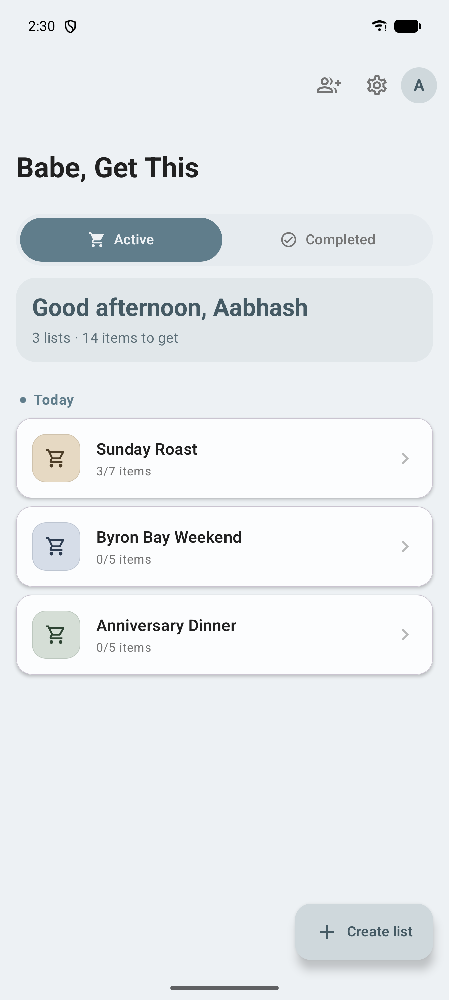
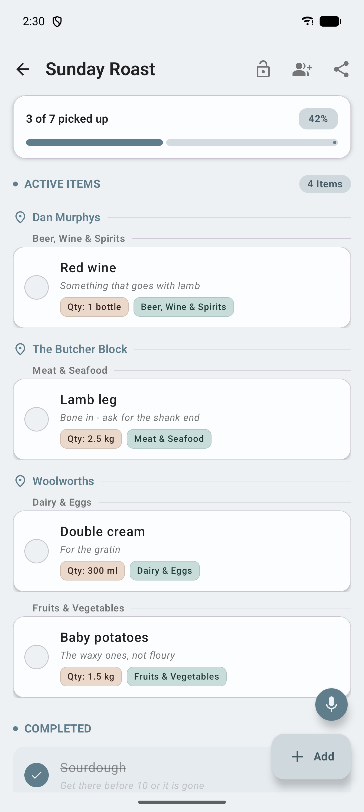
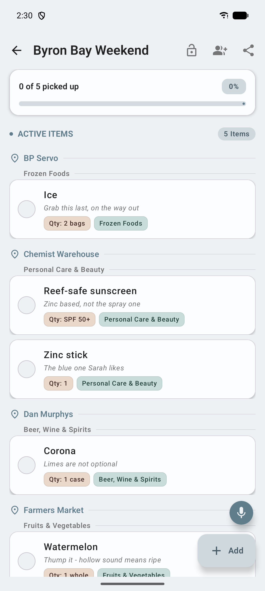
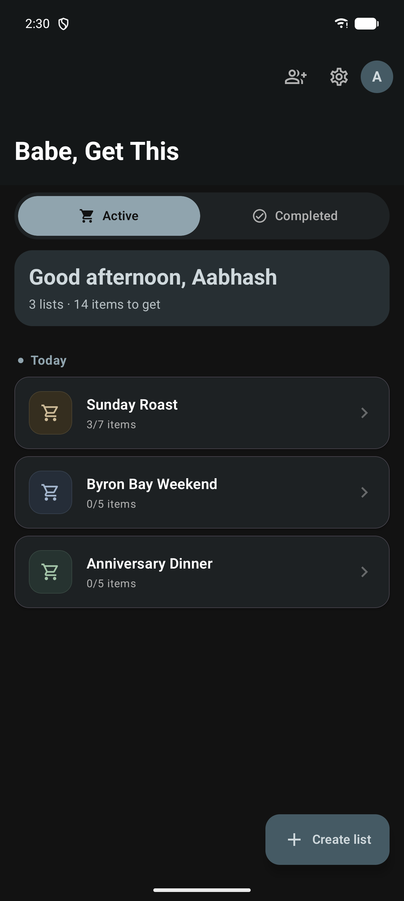
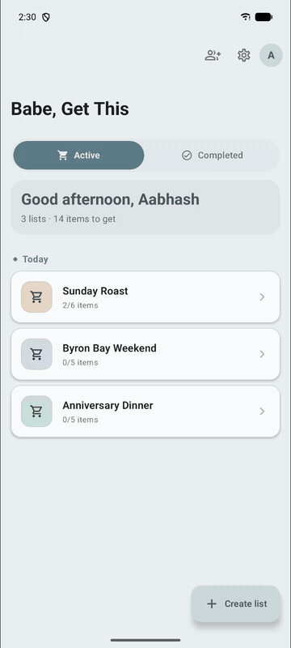

# Babe, Get This

[](https://github.com/AabhashRai13/Babe-get-this/actions/workflows/build-aab.yml)
[](https://github.com/AabhashRai13/Babe-get-this/actions/workflows/instrumented-tests.yml)

A modern, offline-first shopping list app for couples — built with Jetpack Compose and Material 3. Create shared lists, add items as you think of them, and sync with your partner when you're online.

## Screenshots

| Home | A list, by shop | Another list |
| :--: | :--: | :--: |
|  |  |  |

Light and dark both follow the system setting:





## Features

- Create and manage multiple shopping lists
- Voice capture — dictate your groceries and get a new, auto-named list (requires internet)
- Add items with quantities, categories, notes, and a per-item shop
- Mark items as picked up with a single tap, with undo on accidental deletes
- Share any list as plain text through any messaging app
- Time-aware greeting and progress tracking on the home screen
- Fully usable offline — Room is the single source of truth
- Light and dark theme that follow the system setting
- Authenticated accounts, with real-time sync between partners over a shared list code

## Tech Stack

- **Language** — Kotlin
- **UI** — Jetpack Compose with Material 3 (Material You)
- **Architecture** — MVVM + Repository
- **Async** — Kotlin Coroutines + Flow
- **Dependency Injection** — Hilt
- **Local Storage** — Room (offline-first)
- **Auth** — Supabase (email/password sessions with automatic token refresh)
- **Networking** — Retrofit + Kotlin Serialization (voice transcription API)
- **Min SDK** 24, **Target SDK** 36

## Project Structure

```
app/src/main/java/com/babegetthis/android/
├── BabeGetThisApp.kt          # Application class — Hilt entry point
├── MainActivity.kt            # Single-activity host
├── navigation/                # Compose NavHost graph
├── ui/theme/                  # Color palette, typography, theme wiring
├── core/                      # Cross-feature building blocks
│   ├── auth/                  # Login, registration, tokens, session state
│   ├── data/                  # Network clients and shared data sources
│   ├── error/                 # App-wide error types and Result wrappers
│   ├── model/                 # Shared domain models
│   ├── network/               # Connectivity monitoring
│   ├── ui/                    # Reusable Compose components
│   ├── util/                  # Formatters and shared helpers
│   └── voice/                 # Voice recording, transcription client, capture UI
└── feature/                   # Feature modules — each owns its data, model, ui
    ├── profile/               # Profile bottom sheet
    ├── shoppinglist/          # List catalog (home screen)
    └── shoppingitems/         # Items inside a list
```

Each feature directory follows a consistent shape:

```
feature/<name>/
├── data/         # Repositories, DAOs, mappers
├── model/        # Domain models and UI state
└── ui/           # Screens, ViewModels, components
```

## Building locally

Clone, add a `local.properties`, build. Nothing else is needed for a debug build.

### Configuration

`local.properties` is gitignored and holds every secret the build reads. It is
also where the Android SDK path lives, so the file already exists after opening
the project in Android Studio once.

| Key | Needed for | If absent |
| --- | --- | --- |
| `SUPABASE_URL` | Any build that signs in | Falls back to an empty string; the app builds and runs, and auth calls fail |
| `SUPABASE_ANON_KEY` | Any build that signs in | Same as above |
| `RELEASE_STORE_FILE` | Signed release builds only | The release build is produced unsigned |
| `RELEASE_STORE_PASSWORD` | Signed release builds only | Same as above |
| `RELEASE_KEY_ALIAS` | Signed release builds only | Same as above |
| `RELEASE_KEY_PASSWORD` | Signed release builds only | Same as above |

The Supabase anon key is safe to ship inside the app — it is public by design,
and the actual protection is Supabase Row-Level Security. It lives in
`local.properties` to keep it out of git history, not because exposure would be
a breach.

The `dev` flavour uses a fake auth repository and needs no Supabase keys at all,
so `./gradlew installDevDebug` works on a fresh clone with an empty
`local.properties`.

```properties
# local.properties
sdk.dir=/Users/you/Library/Android/sdk
SUPABASE_URL=https://your-project.supabase.co
SUPABASE_ANON_KEY=your-anon-key
```

### Commands

```bash
./gradlew installDevDebug            # Build and install; no configuration needed
./gradlew spotlessApply              # Format Kotlin and Gradle scripts
./gradlew spotlessCheck              # Fails on unformatted code
./gradlew lintProdDebug              # Android Lint; warnings are errors
./gradlew testProdDebugUnitTest      # Unit and Compose tests, on the JVM
./gradlew koverVerifyDevDebug        # Coverage gate
./gradlew bundleProdRelease          # Minified release bundle
```

JDK 17 is required to run Gradle. The app itself compiles to Java 17 bytecode.

### Release builds

Release builds run R8 with resource shrinking — roughly half the bundle size of
an unshrunk build. The keep-rules for the reflection-dependent libraries are in
[`app/proguard-rules.pro`](app/proguard-rules.pro), each block commented with
what breaks without it.

Because the shipped code is obfuscated, a release crash is only readable through
the R8 mapping file. The Crashlytics Gradle plugin uploads it automatically on
every release build.

A baseline profile ships with the release artifact and is regenerated from
[`:baselineprofile`](baselineprofile/README.md) when the startup path changes.

### Build Variants

The app ships with three variants that can be installed side by side:

| Variant   | Application ID                     | Notes                                |
| --------- | ---------------------------------- | ------------------------------------ |
| `dev`     | `com.babegetthis.android.dev`      | Local development; uses fake auth    |
| `staging` | `com.babegetthis.android.staging`  | Hits the staging backend and the staging Supabase project |
| `prod`    | `com.babegetthis.android`          | Release build                        |

### Google sign-in setup

Each flavor's Google client comes from its own `google-services.json`
(`default_web_client_id`, generated by the Google Services plugin), so there
is nothing to switch by hand:

| Flavor    | Firebase / GCP project | Supabase project whose Google provider lists that web client |
| --------- | ---------------------- | ------------------------------------------------------------- |
| `dev`     | `babe-get-this-stg`    | none (fake auth)                                              |
| `staging` | `babe-get-this-stg`    | staging                                                       |
| `prod`    | `babe-get-this`        | production                                                    |

Google sign-in only succeeds when the installed app's package name and
signing-key SHA-1 match an Android OAuth client. The account sheet can still
open when they don't; it fails after an account is picked. Play re-signs every
install with its own app signing key, which is not our upload key, so the prod
Firebase app lists three fingerprints:

- debug, for Android Studio builds
- the upload key, for locally built release builds
- the Play App Signing key, for installs from Play. Copy it from Play Console →
  Test and release → App integrity → App signing.

A missing Play fingerprint breaks sign-in only in the Play build, and every
sideloaded build still works, so test Google sign-in on a Play-installed build
before a release. Get local SHA-1s from `./gradlew signingReport`. The app
reads only the web client ID from `google-services.json`, so adding a
fingerprint in Firebase takes effect without a new build.

In Supabase (Authentication → Sign In / Providers → Google), each project's
**Client IDs** holds only its own environment's web client ID. The client
secret is left empty, because the native ID-token flow doesn't use it. "Skip
nonce checks" stays off.

## Architecture at a Glance

- **UI** stays dumb. Composables observe state from a `ViewModel` and emit user intents back.
- **ViewModel** owns business logic and screen state. It talks to repositories only — never directly to the network or database.
- **Repository** is the single boundary for a feature's data. It mediates between Room (local source of truth) and Retrofit (remote sync), and returns plain Kotlin data classes.
- **Room** is the local store. The app is fully usable offline; sync runs in the background when the user is authenticated and online.

We deliberately stay close to MVVM + Repository. Use cases and a full Clean Architecture split are not introduced unless a screen genuinely needs them.

## Testing

```bash
./gradlew testDevDebugUnitTest        # unit + Compose, on the JVM, seconds
./gradlew koverVerifyDevDebug         # coverage gate
./gradlew connectedDevDebugAndroidTest  # end-to-end, needs an emulator
```

Three layers, each answering a different question:

| Layer | Where | Question it answers |
|---|---|---|
| Unit | `src/test/` | Is this logic correct? |
| Compose | `src/test/` (Robolectric) | Does the screen render and dispatch correctly? |
| End-to-end | `src/androidTest/` | Are the pieces actually wired together? |
| Minified smoke | `baselineprofile/` | Does the *shipped* build still start? |

That last row exists because the end-to-end suite cannot answer it. Those tests
call app internals, and R8's optimizer removes members no shipping code path
reaches — so running them against a minified build fails for reasons that are
not defects. `MinifiedSmokeTest` drives the shrunk, obfuscated app through
UiAutomator instead, with no compile-time reference to anything inside it.

Compose tests run on the JVM under Robolectric, so only the five end-to-end
journeys need a device. Nothing in either suite touches the network — auth,
Supabase and voice transcription are replaced with local fakes, so no
credentials are needed anywhere.

**The coverage gate is a floor, not a grade.** It enforces 100% line coverage on
the logic layer — ViewModels, repositories, mappers, error handling, PIN, auth —
and fails the build below that, so new logic cannot land untested by accident.
Composables sit outside it and are covered by Compose tests instead; a handful of
classes that cannot run on the JVM at all (anything behind `EncryptedSharedPreferences`,
which needs the AndroidKeyStore) are excluded with the reason stated in
`app/build.gradle.kts` and covered by instrumented tests.

It says nothing about whether the tests are any good — a line can execute without
being asserted on. Reviewers still have to read them.

See [docs/running-tests.md](docs/running-tests.md) for running from Android
Studio and for the failure modes worth recognising.

## Contributing

Contributions are welcome. The project is in an early stage and there is plenty of room to shape what comes next.

A few things that help PRs land quickly:

1. **Open an issue first** for anything that changes scope or architecture so we can align before you build.
2. **Keep PRs focused** — one logical change per PR, with a short note on *why*.
3. **Match the existing style** — feature-based packages, MVVM + Repository, Compose for UI, Material 3 color roles for theming.
4. **Run `./gradlew spotlessApply lintProdDebug testProdDebugUnitTest koverVerifyDevDebug`** before pushing. CI runs all four and blocks on each.

If you are not sure where to start, look for issues labeled `good first issue` or open one with your idea — happy to help scope it.

## Roadmap

- [x] Offline list and item management
- [x] Authentication and account creation
- [x] Light and dark theme with Material 3 color roles
- [x] Voice-to-list — dictate a whole shopping list
- [x] Share a list as plain text
- [ ] Auto-categorization of common items
- [x] Real-time sync between partners
- [x] Shared list invitations
- [ ] Camera and gallery capture with image-driven item autofill (v2)
- [ ] "Store room" pantry — completed grocery items carry over to the next list (v2)
